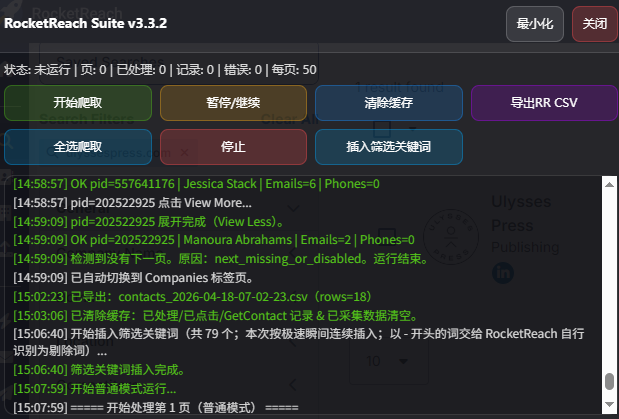

# RocketReach Suite

一个面向 **RocketReach 联系人搜索结果页** 的浏览器端自动化操作脚本。

它不是单一的“联系人采集器”，而是一个集 **普通爬取、全选批量爬取、LinkedIn 链接提取、筛选关键词注入、分页控制、CSV 导出** 于一体的轻量化操作面板。

---

## 项目简介

本项目是一个运行在浏览器页面中的 **JavaScript 注入脚本**。  
执行脚本后，页面左上角会生成一个可拖拽的可视化面板，用于控制 RocketReach 搜索结果页上的常见批量操作流程。

该脚本重点解决了以下问题：

- 手动逐条点击效率低
- 大量联系人分页处理繁琐
- 批量获取联系方式后仍需继续结构化整理
- 搜索筛选词输入重复、机械
- 最后一页继续点击 `下页` 容易进入异常页
- 联系人信息需要统一导出为可二次处理的 CSV

---

## 主要功能

### 1. 普通爬取模式
点击 **开始爬取** 后，脚本会按常规方式逐页处理联系人数据：

1. 识别当前页联系人条目
2. 对单条联系人执行 `Get Contact Info`
3. 必要时点击 `View More`
4. 提取联系人信息
5. 自动翻页并持续处理

适合节奏较稳、需要逐条展开采集的场景。:contentReference[oaicite:2]{index=2}

---

### 2. 全选批量爬取模式
点击 **全选爬取** 后，脚本会优先检测当前页是否存在单条 `Get Contact Info` 按钮。  
如果存在，则自动执行：

1. 勾选当前页全选框
2. 点击 `Get Contacts`
3. 等待 `Continue` 按钮可点击
4. 确认批量获取
5. 按配置等待 2–4 分钟
6. 批量抽取本页联系人数据

如果页面中不存在单条 `Get Contact Info` 按钮，则直接进入数据抽取流程。  
这使脚本既能兼容逐条模式，也能兼容批量模式。:contentReference[oaicite:3]{index=3}

---

### 3. LinkedIn 链接自动提取
新版脚本会在提取联系人时同步抓取对应的 **LinkedIn 链接**。

处理方式包括：

- 从当前联系人区域中的链接直接识别 LinkedIn 地址
- 对带参数的跳转链接做规范化处理
- 必要时通过 LinkedIn 按钮触发捕获
- 将结果缓存到当前联系人对应记录中

导出 CSV 时，LinkedIn 会作为独立字段输出。:contentReference[oaicite:4]{index=4}

---

### 4. 自动插入筛选关键词
点击 **插入筛选关键词** 后，脚本会自动向 RocketReach 的 `Enter Job Title...` 输入框写入一组预设关键词与剔除词。

特点：

- 支持正向关键词
- 支持以 `-` 开头的排除词
- 首次运行按原节奏逐个插入
- 后续运行可更快连续插入

适合固定行业、固定人群方向的重复筛选工作。:contentReference[oaicite:5]{index=5}

---

### 5. 联系人信息提取
脚本会从当前联系人卡片中提取以下字段：

- 姓名
- 职位
- LinkedIn
- 公司
- 地址
- 邮箱（含邮箱标识）
- 电话

其中：

- 邮箱会自动去重
- 电话会保留页面显示格式
- `Main` 和 `Other` 区域中的联系方式会合并采集

导出结果更适合后续在 Excel、Google Sheets、Python 中继续处理。:contentReference[oaicite:6]{index=6}

---

### 6. CSV 导出
点击 **导出RR CSV** 后，脚本会将当前已采集的数据导出为 CSV 文件。

表头会根据当前采集结果自动扩展，例如：

- 姓名
- 职位
- LinkedIn
- 公司
- 地址
- 邮箱标识1 / 邮箱1
- 邮箱标识2 / 邮箱2
- 电话1 / 电话2 / ...

适用于联系人数量、邮箱数量、电话数量不固定的批量结果整理场景。:contentReference[oaicite:7]{index=7}

---

### 7. 分页自动处理
脚本支持自动翻页，并对分页边界做了专门处理：

- 自动识别每页联系人数量
- 自动滚动加载当页条目
- 自动点击 `Next page`
- 检测翻页后首条数据是否变化
- 识别 `No results found` 异常页
- 当确认到达最后一页时自动停止

这能显著减少翻页过程中的人工干预。:contentReference[oaicite:8]{index=8}

---

### 8. 最后一页自动停止
针对 RocketReach 最后一页继续点 `下页` 可能进入 `No results found` 的情况，新版脚本已做保护逻辑：

- 翻页后若检测到 `No results found`
- 自动判定上一页已是最后一页
- 尝试回到上一页结果页
- 停止后续运行

这一点是新版脚本的重要稳定性改进。:contentReference[oaicite:9]{index=9}

---

### 9. 运行结束后自动切换到 Companies
普通模式和全选模式在确认没有下一页后，都会尝试自动切换到 **Companies** 标签页。

这让脚本在完成当前联系人分页任务后，可以自然衔接到下一个页面操作阶段。:contentReference[oaicite:10]{index=10}

---

## 面板功能

脚本运行后会生成一个悬浮面板，当前版本包含以下主要按钮：

- **开始爬取**
- **全选爬取**
- **暂停/继续**
- **停止**
- **清除缓存**
- **导出RR CSV**
- **插入筛选关键词**

面板同时会显示：

- 当前状态
- 当前页码
- 已处理数量
- 已采集记录数
- 错误数
- 当前每页数量

下方日志区会实时输出执行过程，便于观察运行状态与定位异常。:contentReference[oaicite:11]{index=11} :contentReference[oaicite:12]{index=12}

---

## 适用场景

本项目适合以下类型的工作：

- 批量整理 RocketReach 联系人信息
- 自动化筛选特定岗位人群
- 获取并整理联系人 LinkedIn 信息
- 将网页结果结构化导出为 CSV
- 需要普通模式与批量模式混合使用的联系人搜集场景

---

## 使用方式

### 方法一：浏览器控制台运行
1. 打开 RocketReach 搜索结果页面
2. 打开浏览器开发者工具
3. 切换到 `Console`
4. 粘贴本项目脚本并执行
5. 等待页面左上角出现控制面板
6. 选择需要的运行模式开始操作

---

## 操作建议

### 推荐使用顺序
#### 方案 A：逐页常规采集
1. 打开目标搜索结果页
2. 注入脚本
3. 点击 **开始爬取**
4. 观察日志输出
5. 采集完成后点击 **导出RR CSV**

#### 方案 B：优先批量获取联系方式
1. 打开目标搜索结果页
2. 注入脚本
3. 点击 **全选爬取**
4. 等待脚本完成批量获取与抽取
5. 采集完成后导出 CSV

#### 方案 C：先构建筛选，再开始抓取
1. 打开筛选面板
2. 点击 **插入筛选关键词**
3. 等待筛选词写入完成
4. 再执行普通爬取或全选爬取

---

## 异常处理机制

脚本在以下情况下会暂停或停止，以减少误操作：

- 当前页没有识别到联系人列表
- `Get Contact Info` 为灰色不可点击
- `Get Contacts` 未出现或不可点击
- `Continue` 按钮未出现或不可点击
- `View More` 展开失败
- 页面进入 `No results found`
- 分页状态异常

你可以通过日志区快速定位当前卡在哪一步，再决定是继续、停止还是重新运行。:contentReference[oaicite:13]{index=13}

---

## 技术特点

- 纯前端脚本，无需后端
- 直接运行于浏览器当前页面
- 支持双模式采集
- 支持 LinkedIn 链接捕获
- 支持筛选条件自动注入
- 支持分页与边界页自动处理
- 支持日志可视化
- 支持缓存清理与中断控制
- 支持结构化 CSV 导出

---

## 适配说明

本项目基于当前 RocketReach 页面结构编写，依赖的关键页面元素包括但不限于：

- `profile-selection-*`
- `Get Contact Info`
- `Get Contacts`
- `Continue`
- `View More / View Less`
- `Next page / Previous page`
- `Enter Job Title...`
- `Companies` 标签页

如果目标网站更新了按钮文案、节点结构、类名或交互流程，脚本可能需要同步调整。

---

## 风险与说明

本项目仅用于：

- 已授权的数据整理
- 合规的自动化辅助操作
- 技术研究与项目演示

请在使用前确认目标平台的使用条款、账号权限和合规边界。  
由不当使用带来的风险，由使用者自行承担。
